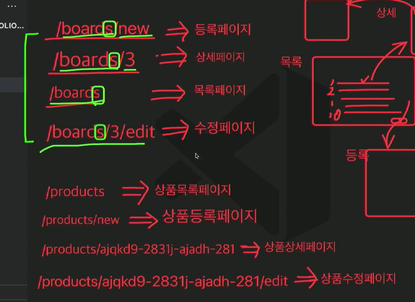

## 코드를 짤 때 주의사항
 - 처음부터 내가 짠 코드라고 자만하지 말것. 
   1300줄 스스로 짰다고 해서 대단한게 아니라 남들이 봤을 때에도 이해가 바로 가도록 코드를 짜자
   내 지식 자랑하는 게 아니라 실무이기 때문에 남들과 협업하는 것을 항상 염두해 두자.


### URL 경로를 짜서 라우팅을 할때 일관된 규칙으로 폴더 구조를 짜자

```js
    /boards/new => 게시판 등록페이지
    /boards/3 => 게시판 boardId 3번의 상세페이지
    /boards => 게시판 목록페이지
    /boards/3/edit => 게시판 boardId 3번의 수정 페이지


    /products/new => 상품 등록페이지
    /products/3 => 상품 productId 3번의 상세페이지
    /products => 상품 목록페이지
    /products/3/edit => 상품 productId 3번의 수정 페이지
```

## 코딩테스트 공부방법(개발남 노씨)
<난이도 별>
기본: 재귀(Recursion), Queue, stack, linked list, hash map, String, graph
중급: DFS, BFS, DP, 완전탐색
심화: Priority Queue, Binary search

<공부 순서>
1. 무조건 문제풀면서! => 백준, SW Expert Academy, 프로그래머스
2. 강의 => mycodeschool, 동빈나 알고리즘 강좌, 백준강의

## 코딩테스트 공부방법(큰돌)
<필수적인 개념학습>
누적합, 구현, 그래프이론, DFS, BFS, 트리순회, 완탐, 백트래킹, 비트마스킹, 그리디, 라인스위핑,
LIS, 이분탐색, DP, 최단거리, 펜윅트리

<문제풀기 어디까지?>
백준 플레이상 또는 프로그래머스 레벨 5 (160문제 정도는 풀어야함)

