# useState
 
- setState로 값을 변경하면, 해당 컴포넌트는 '리랜더링' 된다.
- setState로 값을 변경할때, 그 이전값과 연관이 있다면 setState의 인자로 곧바로 값을 넣는 것이 아니라!
  콜백함수로 넣어준다. 콜백함수의 인자에는 기존의 state 값이 들어가 있다.

```js
    const handleUpload = () => {
        setNames((prev) => {
            return [input, ...prev]
        })
    }
```

- map 함수로 배열의 값들을 출력해 줄때에는 꼭 key속성을 부여해 주어야 한다.

- useState에서는 초기 값을 넣어주는데, 무거운 작업을 하고 초기 값을 세팅하는 경우에는 컴포넌트가 리랜더링 될때마다 계속해서 useState도 실행되기 때문에 성능상에 이슈가 생길 수 있다. 컴포넌트가 처음에 렌더링 될때만 실행하고 이후의 렌더링에서는 실행안되게 함수를 만들고 싶다면,,,

```js
const heavyWork = () => {
    console.log('엄청 무거운 작업');
    return ['홍길동', '고길동'];
}

function App() {
    const [names, setNames] = useState(() => {
        return heavyWork();
    })
}
```
이런식으로 useState 초기값을 작성하는 부분에 '콜백함수'로 작성해 주면된다.

# useEffect


- 어떠한 컴포넌트가 처음에 화면에 렌더링 되었을때, state가 바뀌어 재 랜더링 되었을때, 그리고 화면에서 사라졌을때 특정작업을 하고 싶다면 useEffect hook을 사용하면된다.
- useEffect는 기본적으로 '콜백함수'를 인자로 받는다.

### 첫번째 인자에만 콜백함수를 넣는다면, 컴포넌트가 렌더링 될때마다 계속해서 실행된다.
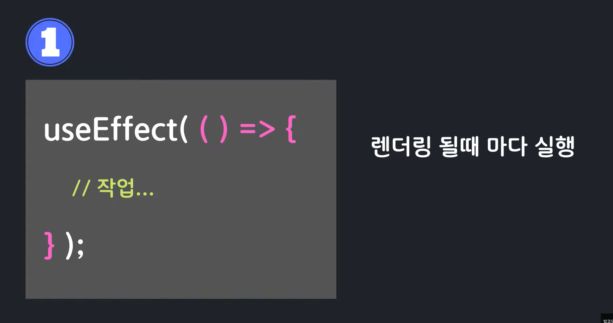

### 두번째 인자에 특정 value 값이 담긴 배열을 넣으면 => 최초 렌더링시 + 그리고 value값이 바뀔때마다 실행된다.
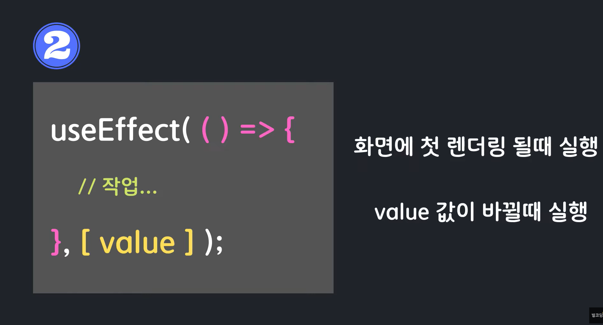

### 두번째 인자에 빈 배열이 들어간다면 => 최초 렌더링시에만 해당 코드가 실행된다.
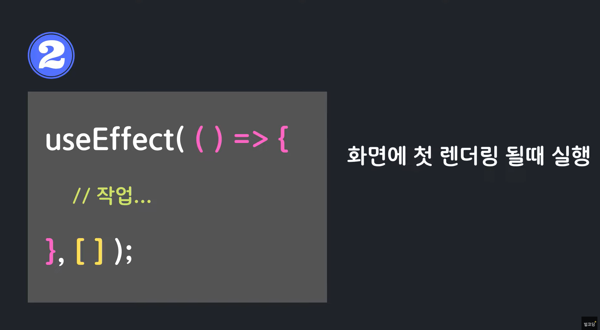

### useEffect 안에 return () => {} 식으로 함수를 리턴하면 해당 컴포넌트가 사라질때 (언마운트될때), 혹은 다음 useEffect가 실행되기 이전에 특정 코드를 실행시킬 수 있다. 보통 setInterval, setTimeout 함수를 삭제 하거나 이벤트리스너를 삭제할때 주로 사용한다.
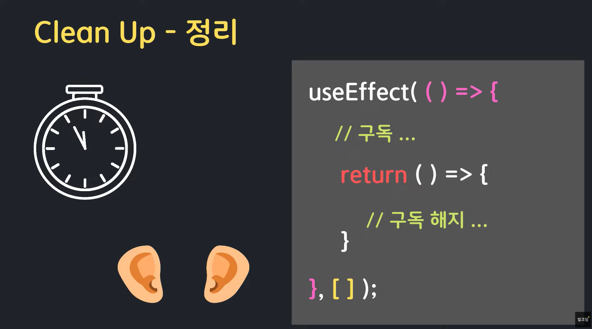

# useRef
## useRef는 보통 두가지 경우로 많이 활용한다.
 1) 리랜더링이 되지 않는 변수를 담을 때
 2) 특정 DOM 객체를 다룰때 (js에서 document.querySelector와 비슷함)

### 함수형 컴포넌트에서 useRef를 사용하면 객체를 리턴하는데 그 내용은 아래 그림을 참고하면 된다.
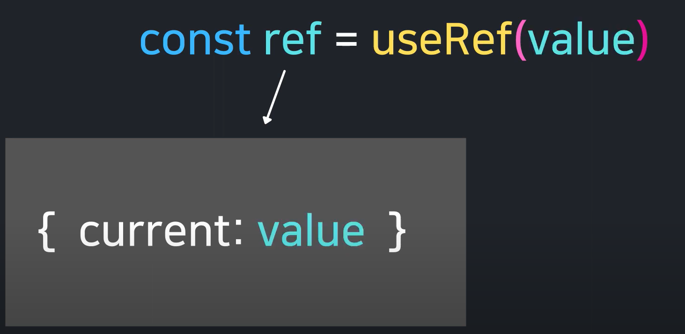
### useRef로 작성한 ref object는 언제든 수정이 가능하기 때문에 언제든 바꿀 수 있다.
### useRef로 작성한 ref object는  컴포넌트 생애 주기동안 계속해서 값을 유지한다. (마운트부터 ~ 언마운트되어 사라질때까지)

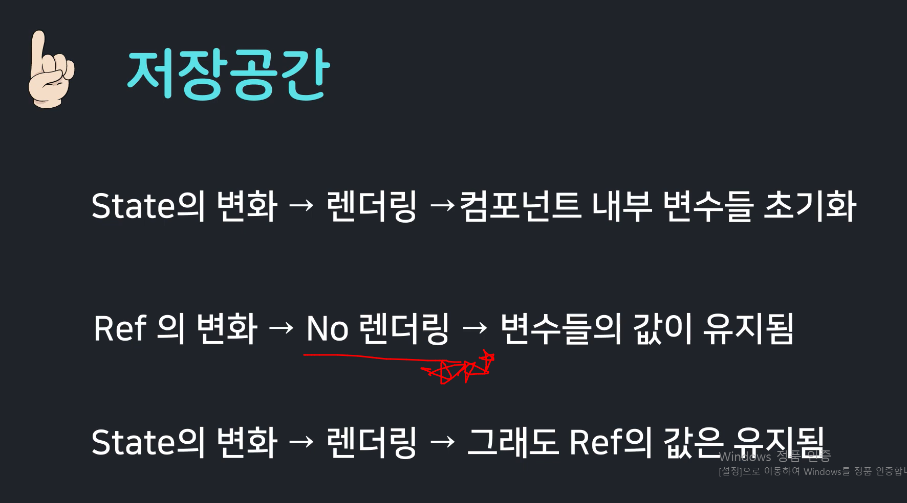

## c.f) setState로 값을 변경할 때 이전값과 동일하다면 리랜더링이 일어나지 않는다! (원시형, 참조형 모두 해당)


# useContext

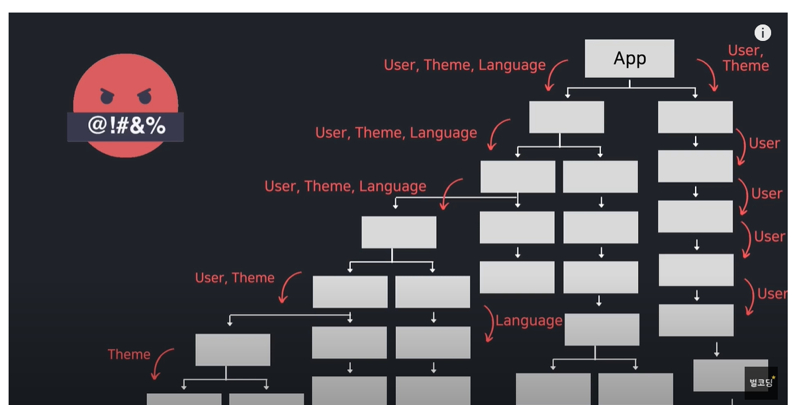

### 위의 그림과 같이 react 개발을 하다보면, 전역적으로 변수를 여러 컴포넌트들에서 사용해야 하는데 react의 프로그래밍상 데이터는 위에서 아래로 prop으로 넘겨주어야 하는데, 프로젝트가 커질수록 이 과정이 복잡해져서 개발자는 고통스러운 코딩경험을 할 것이다.
### 이에 대한 해결책으로 context의 기능이 있다.

## c.f) 컴포넌트에서 하나씩 prop을 전달하는 것을 'Prop Drilling' 이라고 한다.

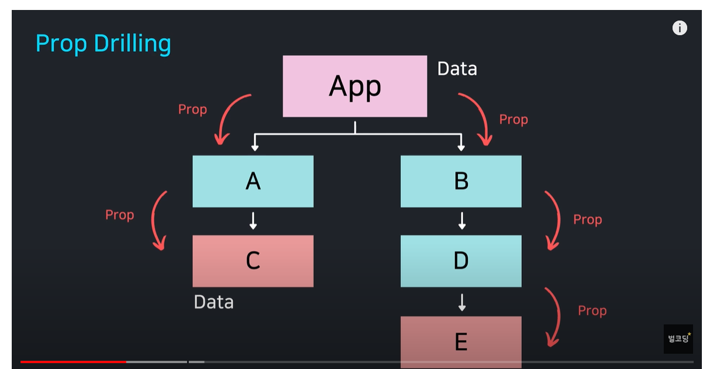

## c.f) 주의사항!
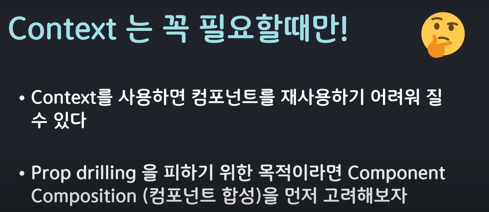

## useContext 사용법
 1) 'createContext'로 context를 만든다. (예시 ThemeContext)
 2) 루트 부분을 1)에서 만든 context로 감싼다
    Context명.Provider로 태그를 명명해주고, value 속성에 전달할 값을 적는다.
 ```js
    import { ThemeContext } from './context/ThemeContext';
    ...
    return (
        <ThemeContext.Provider value={{ isDark, setIsDark }}>

        </ThemeContext.Provider>
    )
 ```
3) context를 받아올 때, useContext hooks를 사용한다.
   ```js
    const data = useContext(ThemeContext);
   ```

c.f) createContext로 context를 만들때 createContext의 파라미터로 들어가는 값은 무엇을 의미할까?
     그 값은 '만약 루트 부분에 Provider로 감싸주지 않았다면', 파라미터로 작성한 값이 전달된다.

# useMemo
react에서 컴포넌트 최적화를 하는데 대표적으로 쓰는 react hooks 중 하나

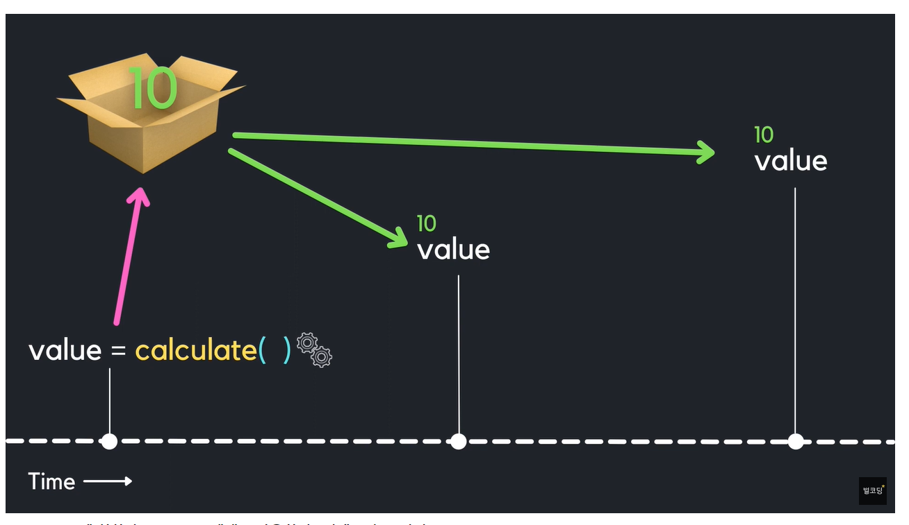

useMemo에서 Memo는 Memoization의 약자인데, 이것은 특정값을 반환하는 함수가 있다면 그 리턴되는 값을 캐싱해서 해당 값을 불러올때마다 캐싱된 값을 가져오는 것을 말한다.

c.f) 함수형 컴포넌트를 렌더링한다는 것은 그 해당 컴포넌트 함수를 호출한다는 것을 의미한다.

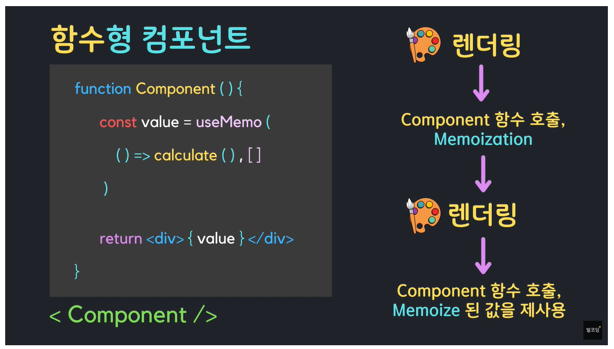

## useMemo의 문법 구조
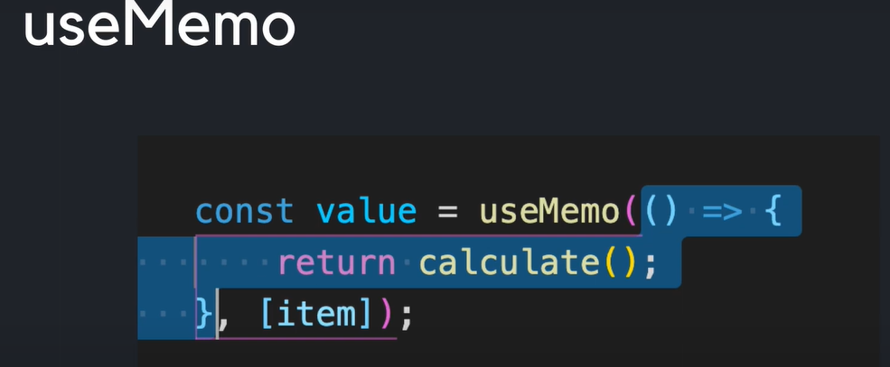

useMemo는 두개의 인자를 받는다 
 - 첫번째 인자 : 콜백함수. 어떤 값을 리턴하는 함수를 리턴한다. 아니면 그 값자체를 리턴해주어도 됨
 - 두번째 인자 : 의존성 배열. 배열 안에 있는 값들이 변할때 첫번째 인자인 콜백함수가 실행되어 다시 메모이제이션한다. 만약 배열안에 아무런 값도 없으면 컴포넌트가 처음 마운트되었을때만 첫번째 인자의 콜백함수를 실행해서 그 값을 메모이제이션한다.

c.f) useMemo는 필요할때만 적절하게 사용해야 함! useMemo는 메모리를 사용해서 변수를 기억하고 있기 때문에 남발하면 오히려 성능이 악화된다.

# useCallback
useCallback역시 useMemo처럼 메모이제이션을 해서 성능 최적화를 해주는 hooks이다

## useMemo vs useCallback 
|구분|useMemo|useCallback|
|---|---|---|
|어떤 것을 메모이제이션하는가?|값|함수
|첫번째 매개변수|값을 리턴하는 함수 또는 값 자체|함수 그 자체

c.f) 자바스크립트에서 함수는 '객체'의 한 종류이다!  
c.f) useCallback으로 함수를 메모이제이션하면 딱 그 시점을 기억하는 것이기때문에 원하는 결과가 나오지 않을 수 있다.

     (예 : 변수값이 처음 메모이제이션한 시점의 값으로 계속 유지됨)

## useCallback의 문법 구조
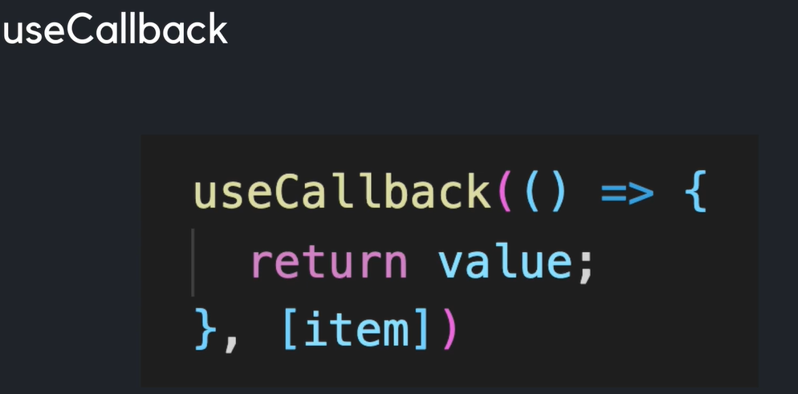

useCallback역시 useMemo와 같은 구조로 기억하면 편하다.
 - 첫번째 인자 : 함수 그 자체를 넣는다. 이 함수가 메모이제이션된다.  
 - 두번째 인자 : 의존성 배열. 배열 안에 있는 값들이 변할때 첫번째 인자인 콜백함수를 다시 재할당하고 그것을 메모이제이션한다.

# useReducer
useReducer는 useState처럼 데이터를 관리하는데 쓰는 react hooks이다. 
그렇다면 어떠한 경우에 useReducer를 쓰는가?
### 여러개의 복잡한 값들을 관리할 때 useState 대신 useReducer를 쓰면 좀 더 쉽게 개발할 수 있다.
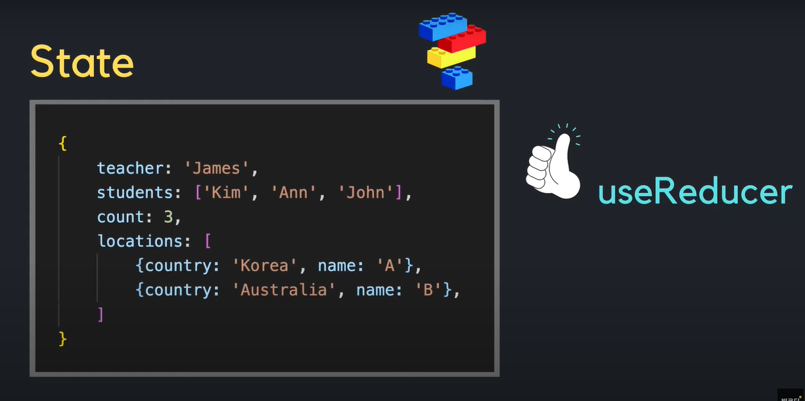

## useReducer를 은행의 예시로 들어설명한 그림
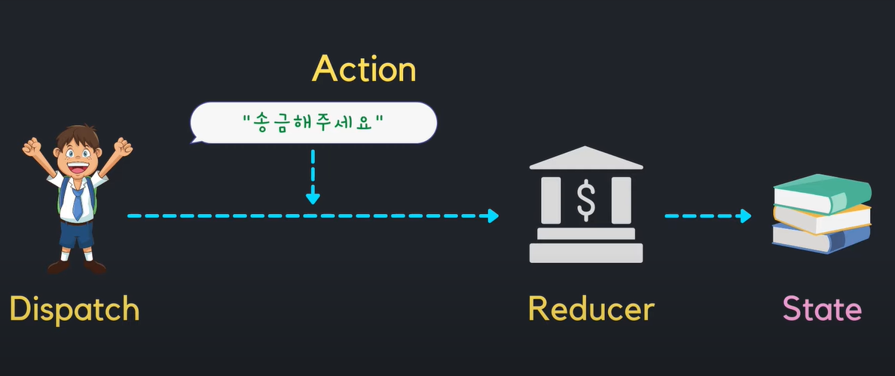
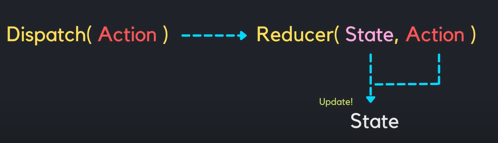

## useReducer 코드 구조 설명
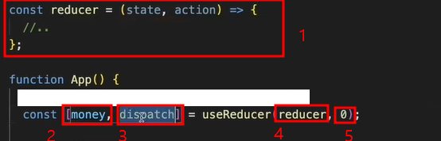  
  - useReducer는 두개의 인자를 받는데 첫번째 인자로 4. reducer를 넣고 두번째 인자로 5. state의 초깃값을 넣는다.
  - 그렇게 useReducer로 만들면 배열이 반환되는데 배열의 첫번째 값 2. 는 state이고, 두번째 3. dispatch는 reducer에게 state를 변경요청하는 역할을 한다. (dispatch는 함수이다.)
  - reducer의 정의는 1번처럼 만든다. 첫번째 인자로 현재의 state값(money)이고, 두번째 인자로 action은 dispatch로 보내는 action 이다.
  - dispatch를 호출하면 reducer가 호출된다.

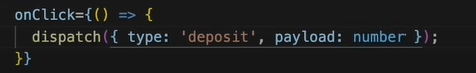  
- dipatch의 인자로 action을 넣는데, action은 object 형태로 넣는다. action의 내부에는 'type'과 'payload'를 넣는다.

c.f) - useReducer로 state를 변경하면 useState처럼 컴포넌트가 리랜더링된다.  
     - useReducer의 장점은 action의 type을 지정한대로만 동작한다는 것이다. 정의하지 않은 action type으로 어떠한 행동을 하더라도 아무런 변화가 일어나지 않는다.

# 커스텀 훅 (custom Hooks)
useState, useEffect 처럼 리액트 환경에서 다양한 훅을 이용하여 편리하게 개발을 할 수 있는데, 반복되는 코드를 줄일 수 있는 custom hooks, 말 그대로 커스텀을 하여 기능을 만들 수 있다. 그것이 바로 커스텀 훅이다.
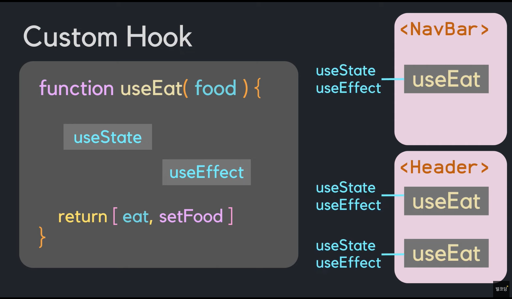  

c.f) 커스텀 훅은 기존의 훅처럼 'use~~~'의 형식으로 만든다. react가 만약 우리가 만든 커스텀 훅이 오류가 있다면 console창에 해당 커스텀훅을 표시해주기 때문이다.
