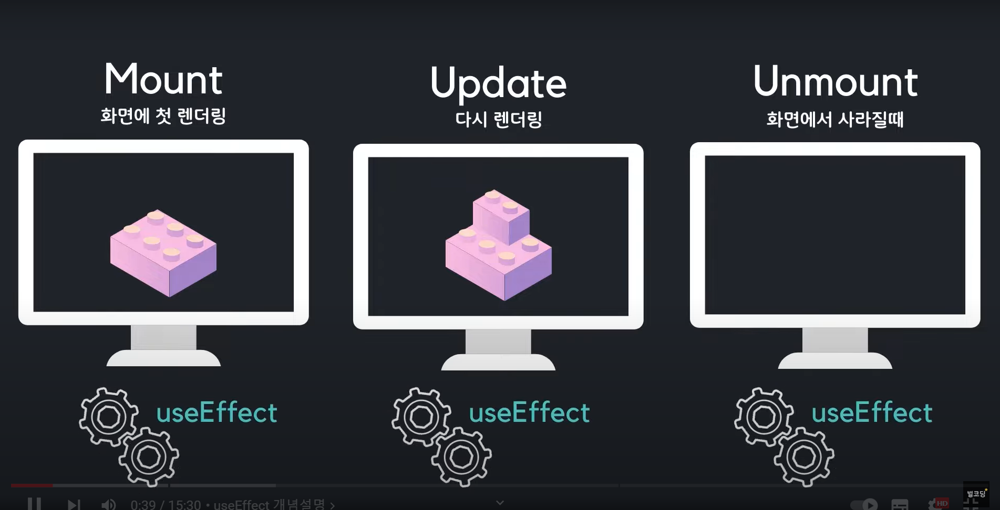

# useState
 
- setState로 값을 변경하면, 해당 컴포넌트는 '리랜더링' 된다.
- setState로 값을 변경할때, 그 이전값과 연관이 있다면 setState의 인자로 곧바로 값을 넣는 것이 아니라!
  콜백함수로 넣어준다. 콜백함수의 인자에는 기존의 state 값이 들어가 있다.

```js
    const handleUpload = () => {
        setNames((prev) => {
            return [input, ...prev]
        })
    }
```

- map 함수로 배열의 값들을 출력해 줄때에는 꼭 key속성을 부여해 주어야 한다.

- useState에서는 초기 값을 넣어주는데, 무거운 작업을 하고 초기 값을 세팅하는 경우에는 컴포넌트가 리랜더링 될때마다 계속해서 useState도 실행되기 때문에 성능상에 이슈가 생길 수 있다. 컴포넌트가 처음에 렌더링 될때만 실행하고 이후의 렌더링에서는 실행안되게 함수를 만들고 싶다면,,,

```js
const heavyWork = () => {
    console.log('엄청 무거운 작업');
    return ['홍길동', '고길동'];
}

function App() {
    const [names, setNames] = useState(() => {
        return heavyWork();
    })
}
```
이런식으로 useState 초기값을 작성하는 부분에 '콜백함수'로 작성해 주면된다.

# useEffect


- 어떠한 컴포넌트가 처음에 화면에 렌더링 되었을때, state가 바뀌어 재 랜더링 되었을때, 그리고 화면에서 사라졌을때 특정작업을 하고 싶다면 useEffect hook을 사용하면된다.
- useEffect는 기본적으로 '콜백함수'를 인자로 받는다.

### 첫번째 인자에만 콜백함수를 넣는다면, 컴포넌트가 렌더링 될때마다 계속해서 실행된다.


### 두번째 인자에 특정 value 값이 담긴 배열을 넣으면 => 최초 렌더링시 + 그리고 value값이 바뀔때마다 실행된다.


### 두번째 인자에 빈 배열이 들어간다면 => 최초 렌더링시에만 해당 코드가 실행된다.


### useEffect 안에 return () => {} 식으로 함수를 리턴하면 해당 컴포넌트가 사라질때 (언마운트될때), 혹은 다음 useEffect가 실행되기 이전에 특정 코드를 실행시킬 수 있다. 보통 setInterval, setTimeout 함수를 삭제 하거나 이벤트리스너를 삭제할때 주로 사용한다.


# useRef
## useRef는 보통 두가지 경우로 많이 활용한다.
 1) 리랜더링이 되지 않는 변수를 담을 때
 2) 특정 DOM 객체를 다룰때 (js에서 document.querySelector와 비슷함)

### 함수형 컴포넌트에서 useRef를 사용하면 객체를 리턴하는데 그 내용은 아래 그림을 참고하면 된다.

### useRef로 작성한 ref object는 언제든 수정이 가능하기 때문에 언제든 바꿀 수 있다.
### useRef로 작성한 ref object는  컴포넌트 생애 주기동안 계속해서 값을 유지한다. (마운트부터 ~ 언마운트되어 사라질때까지)


## c.f) setState로 값을 변경할 때 이전값과 동일하다면 리랜더링이 일어나지 않는다! (원시형, 참조형 모두 해당)


# useContext


### 위의 그림과 같이 react 개발을 하다보면, 전역적으로 변수를 여러 컴포넌트들에서 사용해야 하는데 react의 프로그래밍상 데이터는 위에서 아래로 prop으로 넘겨주어야 하는데, 프로젝트가 커질수록 이 과정이 복잡해져서 개발자는 고통스러운 코딩경험을 할 것이다.
### 이에 대한 해결책으로 context의 기능이 있다.

## c.f) 컴포넌트에서 하나씩 prop을 전달하는 것을 'Prop Drilling' 이라고 한다.


## c.f) 주의사항!


## useContext 사용법
 1) 'createContext'로 context를 만든다. (예시 ThemeContext)
 2) 루트 부분을 1)에서 만든 context로 감싼다
    Context명.Provider로 태그를 명명해주고, value 속성에 전달할 값을 적는다.
 ```js
    import { ThemeContext } from './context/ThemeContext';
    ...
    return (
        <ThemeContext.Provider value={{ isDark, setIsDark }}>

        </ThemeContext.Provider>
    )
 ```
3) context를 받아올 때, useContext hooks를 사용한다.
   ```js
    const data = useContext(ThemeContext);
   ```

c.f) createContext로 context를 만들때 createContext의 파라미터로 들어가는 값은 무엇을 의미할까?
     그 값은 '만약 루트 부분에 Provider로 감싸주지 않았다면', 파라미터로 작성한 값이 전달된다.

# useMemo
함수형 컴포넌트를 렌더링한다는 것은 그 해당 컴포넌트 함수를 호출한다는 것을 의미한다.
